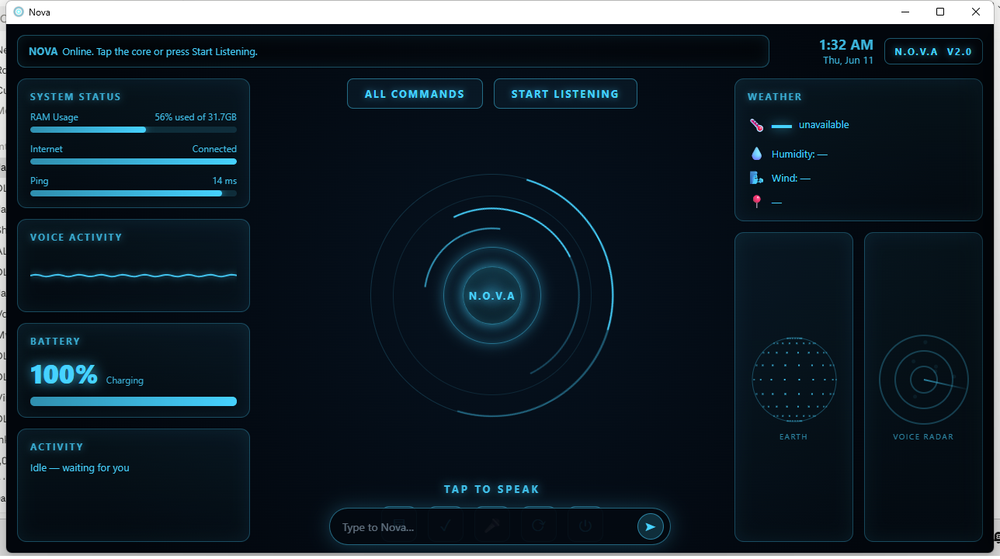

# Nova — Your Own AI Voice Assistant

[](LICENSE)
[](https://www.python.org/downloads/)
[](#-quick-start)
[](https://www.anthropic.com)

**Created by [Dany Denis](https://github.com/danydenis560-beep) · founder of [DLC Market](https://dlcmarket.com)**

Nova is a hands-free **AI voice assistant for Windows**. You talk to it; it listens
(local speech-to-text), thinks with **Claude**, controls your PC, sees your screen,
runs your day, and can even be controlled from your phone — all shown in a glowing
desktop window.

> No cloud account except your own Claude API key. Speech recognition runs **locally** on
> your PC. The voice is **free**. Everything optional is off until you switch it on.



## ✨ Features

- 🎙️ **Talk to it, it talks back** — local speech-to-text ([faster-whisper](https://github.com/SYSTRAN/faster-whisper)) and free neural voices ([edge-tts](https://github.com/rany2/edge-tts))
- 🧠 **Claude brain** with live web search and a safe tool-use loop
- 🖥️ **Controls your PC** — opens apps, files, and websites; runs commands behind an on-screen **Allow / Deny** gate
- 👀 **Vision** — reads your screen, documents, PDFs, and images (and the webcam, optionally)
- 🧩 **Memory, a to-do list, and a live dashboard** (weather, clock, system stats)
- 🌍 **Multilingual** — understands and replies in **English, French, and Haitian Creole**
- 📱 **Phone access** — control it from your phone over your home Wi-Fi or [Tailscale](https://tailscale.com), password-protected
- 🔌 **Optional integrations** — Google Calendar, YouTube stats, a daily spoken briefing, Telegram, Discord, Outlook email, and Shopify (each stays off until you add a key)
- 🔒 **Hands-free voice lock** — in always-listening mode it answers **only your enrolled voice** ([SpeechBrain](https://speechbrain.github.io) speaker ID)

## 🚀 Quick start

> **Requirements:** Windows 10/11 · [Python 3.12](https://www.python.org/downloads/) · a microphone · an [Anthropic API key](https://console.anthropic.com).

```powershell
# 1) Get the code
git clone https://github.com/danydenis560-beep/nova-voice-assistant.git
cd nova-voice-assistant

# 2) Create a virtual environment and install the packages
python -m venv .venv
.\.venv\Scripts\Activate.ps1
pip install -r requirements.txt

# 3) Add your Claude API key
copy .env.example .env
#    then open .env in Notepad and paste your key after ANTHROPIC_API_KEY=

# 4) Run it
python launch_nova.pyw      # …or just double-click launch_nova.pyw
```

The glowing window opens. Tap the orb (or the 🎤 button) and talk — or type in the bar at
the bottom. Try: *"what time is it?"*, *"open Notepad"*, *"what's the weather?"*,
*"add milk to my to-do list"*, *"take a screenshot and tell me what you see."*

> 📖 New to all this? The **[full beginner guide](docs/GUIDE.md)** walks through every step
> in plain language, including how to get your API key and go hands-free.

## ⚙️ Configuration

Every setting lives in `.env` (copy it from `.env.example`). The **only required** one is
your Claude API key. Common options:

| Setting | What it does | Default |
|---|---|---|
| `ANTHROPIC_API_KEY` | Your Claude key — **required** | — |
| `NOVA_MODEL` | Which Claude model to use | `claude-sonnet-4-6` |
| `NOVA_WHISPER_MODEL` | Local speech model size (`tiny`/`base`/`small`) | `base` |
| `NOVA_LANGUAGE` | Lock a language, or blank to auto-detect | auto |
| `NOVA_TTS_EDGE_VOICE` | The neural voice Nova speaks in | `en-GB-RyanNeural` |
| `NOVA_ACCESS_PASSWORD` | Set this to enable phone access | _(off)_ |
| `NOVA_UNITS` | Weather units (`metric` / `imperial`) | `metric` |

See [`.env.example`](.env.example) for the complete, commented list (voice tuning, weather
location, and every optional integration).

## 🧠 How it works

```
🎤 Microphone
   → Silero VAD          detects when you're actually speaking (ignores noise)
   → faster-whisper      transcribes your speech locally, on your PC
   → Claude (brain.py)   thinks, optionally searches the web, and calls tools
   → edge-tts            speaks the reply in a natural neural voice
```

A local **FastAPI** server (`server.py`) drives the WebSocket **HUD** (`static/index.html`)
shown in a native **WebView2** window (`launch_nova.pyw`). In hands-free mode, **SpeechBrain**
speaker verification means Nova replies only to your enrolled voice.

## 📱 Phone access

Set `NOVA_ACCESS_PASSWORD` in `.env` and Nova becomes reachable from your phone — **your PC
window never needs the password**. On the same Wi-Fi, open `http://<your-pc-ip>:8765` and log
in. For access from anywhere (even cellular), install [Tailscale](https://tailscale.com) on
both devices and use the PC's `100.x` address. Because Nova can run commands on your PC, phone
access is **off by default** and always password-gated. See [Security](#-privacy--security).

## 🗂️ Project structure

| File | Role |
|---|---|
| `launch_nova.pyw` | Launcher — starts the server and opens the desktop window (double-click to run) |
| `server.py` | The engine: mic → Whisper → Claude → neural voice, plus FastAPI/WebSocket and the phone-access gate |
| `brain.py` | Claude integration — builds the tool set and system prompt, runs the tool-use loop |
| `tools.py` | PC-control tools: open apps/files/URLs, run PowerShell (Allow/Deny gated), clipboard, dashboard |
| `auth.py` | Phone-access security: the local window is trusted; other devices need the password |
| `vision.py` | Screen capture, document/PDF/image reading, webcam (optional) |
| `vad.py` · `voiceid.py` | Speech detection (Silero) · speaker verification (SpeechBrain) |
| `memory.py` · `tasks.py` | Long-term memory · to-do list (both local JSON) |
| `dashboard.py` · `system_stats.py` | Dashboard data: greeting/clock, weather, live RAM/battery/ping |
| `briefing.py` · `files.py` | Daily spoken briefing · save text/PDF files to the PC |
| `gcal.py` · `youtube.py` · `messaging.py` · `outlook.py` · `shopify_tools.py` | Optional integrations |
| `nova.py` | A simple console (push-to-talk) version + the mic picker |
| `config.py` · `.env.example` | All settings (read from your `.env`) |
| `static/` | The HUD (`index.html`) and phone login page (`login.html`) |

## 🔒 Privacy & security

- **Runs on your machine.** Speech-to-text is local (Whisper) — your audio is transcribed on
  your PC, not uploaded to a speech service.
- **Your keys stay yours.** They live only in your local `.env`, which is **git-ignored** and
  never committed. You bring your own API keys and are responsible for any usage and costs.
- **The AI brain.** Like any AI app, the text (and any image you ask it to look at) is sent to
  Anthropic's Claude API to generate a reply; web search runs server-side at Anthropic.
- **Command execution is gated.** Nova asks before running anything on your PC via an on-screen
  Allow / Deny prompt (`NOVA_CONFIRM_SHELL`).
- **Phone access is locked down.** It's off until you set a password. The local window is trusted
  over loopback; other devices must log in, the session cookie is a one-way hash of the password,
  and comparisons are constant-time. Changing the password instantly logs every device out.

Found a security issue? See [SECURITY.md](SECURITY.md).

## 🛟 Troubleshooting

- **Won't start?** Make sure Python was installed with **"Add python.exe to PATH"**, and that you
  ran `pip install -r requirements.txt` inside the **activated** virtual environment (you'll see
  `(.venv)` at the start of the prompt). Check `nova_hud.log` for errors.
- **Mishears you?** Use a headset and set `NOVA_WHISPER_MODEL=small` for better accuracy.
- **No voice out?** The neural voice needs internet; offline it falls back to the built-in
  Windows voice.
- **Ignores you in hands-free mode?** Lower the match threshold: `NOVA_VOICE_THRESHOLD=0.10`.
- **Phone can't connect?** Confirm both devices are on the same Wi-Fi (or Tailscale), and allow
  the Windows Firewall prompt the first time.

## 🤝 Contributing

Contributions are welcome — see [CONTRIBUTING.md](CONTRIBUTING.md).

## 📄 License

Released under the [MIT License](LICENSE). You bring your own API keys and are responsible for
your own usage and any costs on those accounts. Provided **"as is"**, without warranty.

## 🙏 Acknowledgements

Built on [Anthropic Claude](https://www.anthropic.com), OpenAI Whisper (via
[faster-whisper](https://github.com/SYSTRAN/faster-whisper)),
[Silero VAD](https://github.com/snakers4/silero-vad),
[SpeechBrain](https://speechbrain.github.io),
[edge-tts](https://github.com/rany2/edge-tts), and
[pywebview](https://pywebview.flowrl.com).

## 👤 Author

Created by **[Dany Denis](https://github.com/danydenis560-beep)** — founder of **[DLC Market](https://dlcmarket.com)**,
building open-source AI, automation, and developer tools. If Nova is useful to you, a ⭐ on the
repo means a lot!
